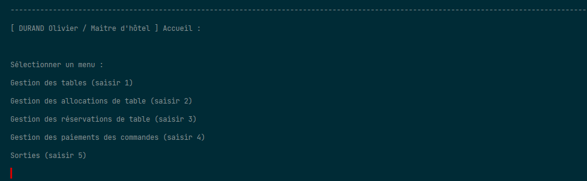
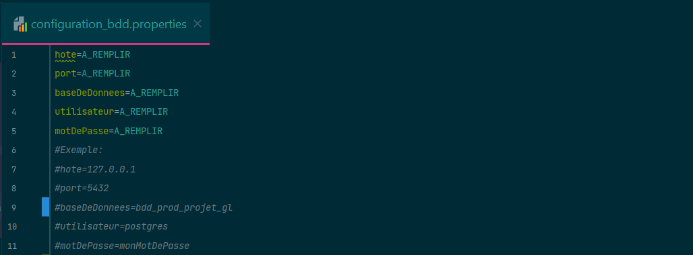
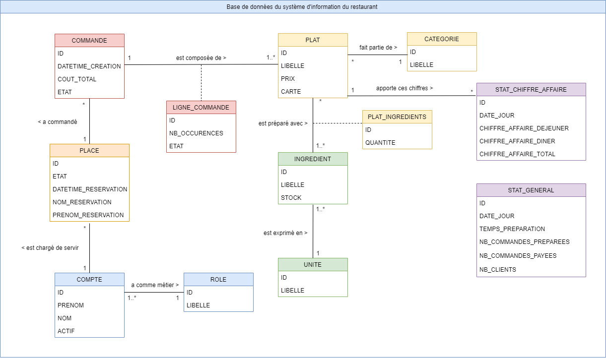
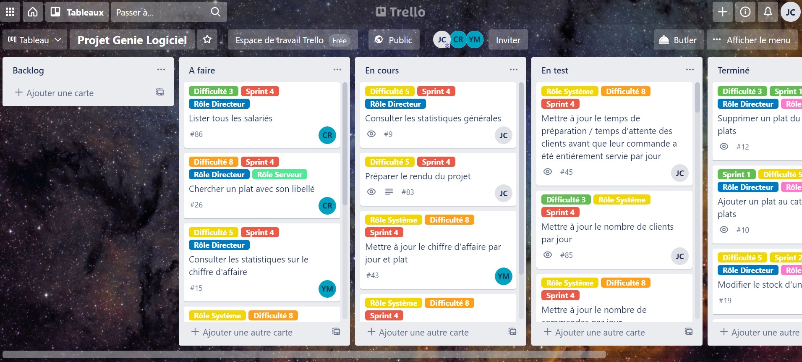
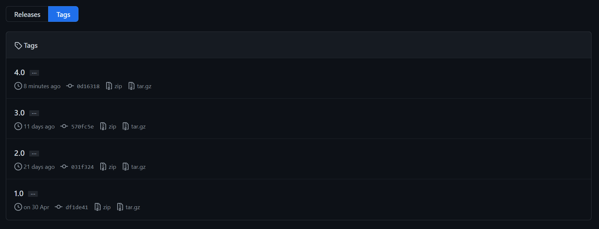
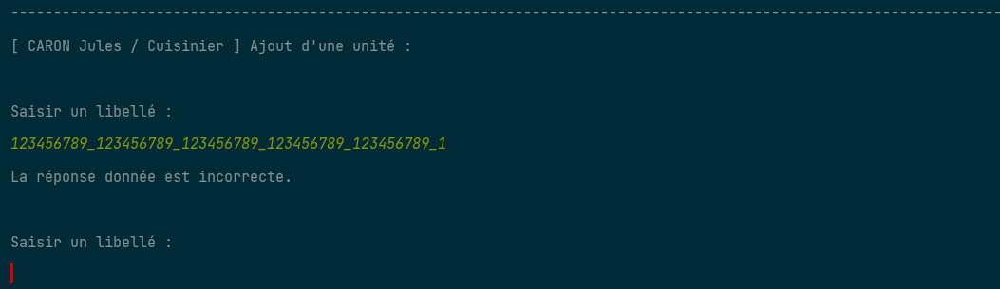
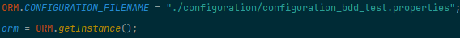
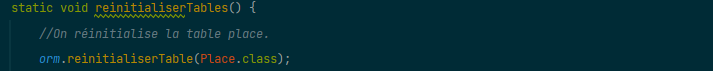

## Projet Restaurant

### Résumé

Projet implémentant une application pour un restaurant.

Cette application propose différents accès avec différentes 
<b>fonctionnalités</b>, en fonction des <b>rôles</b> existants dans le restaurant.
 
 
Voici une liste des rôles du restaurant, ordonné par degré de responsabilité
(du plus élevé au plus faible) : 
- `Directeur` : il peut tout faire dans le restaurant et a en charge pour
  lui seul certaines fonctionnalités comme la composition de la carte du jour,
  ou l'accès aux statistiques.
   
   
- `Maitre d'hôtel` : il accueille les clients, alloue et désalloue les tables
  aux clients et aux serveurs, s'occupe des réservations, et prend en charge les paiements
  des clients.
   
   
- `Cuisinier` : il compose le catalogue du restaurant : ingrédients, unités, catégories,
  plats, gère les stocks, et prépare les plats commandés.
   
   
- `Serveur` : il assiste les clients : il fait les commandes pour
  les clients et les sert, il est chargé de certaines tables précises du restaurant
  qui lui ont été allouées.
   
   
- `Assistant de service` : il prépare les tables, c'est-à-dire qu'il les nettoie après chaque départ
des clients.

 
Cette application met à disposition des utilisateurs une 
interface console pour communiquer avec elle.
 
 
Cette application est à voir comme un logiciel métier, fonctionnant comme un
intranet, au sens qu'elle est réservée aux agents du restaurant, il ne s'agit
pas d'une application "vitrine".

____ 
### Organisation

Université de Lorraine
 
Master 1 MIAGE

____ 
### Auteurs

- CHEVRIER Jean-Christophe
- HADJ MESSAOUD Yousra
- LOUGADI Marième

____ 
### Règles de gestion

Cette partie est une aide à la compréhension de l'application, elle définit les règles de gestion sur lesquelles se basent
les comportements de l'application.

Une commande est créée avec l'état `en attente` après avoir été commandée, puis elle passe à `servi` lorsque que tous
les plats commandés la composant  (lignes de commande) ont été servis par un serveur. Enfin, elle passe à `payé` lorsque 
le client règle l'addition avec le maitre d'hôtel.

Une ligne de commande représente un plat commandé, elle est au départ `en attente`. Elle passe à
`prêt` lorsque le cuisinier signale qu'elle est prête, et à `servi` lorsque le serveur signale qu'il a fait le service,
et donc qu'il l'a servi au client.

Une table est à l'état `libre` si elle est propre, inoccupée, et pas réservée. Une table passe à `occupé` lorsque le 
maitre d'hôtel l'alloue à un client, puis elle passe à `sale` lorsque le client part, et que le maitre d'hôtel la désalloue.
Enfin, une table passe de `sale` à `libre`, après qu'un assistant de service l'ait préparée / nettoyée.
Et bien sûr, si une table est la cible d'une réservation sur place ou par téléphone, le maitre d'hôtel l'a passe à `réservé`.

Un plat peut être commandé seulement s'il est disponible, il n'est pas forcé de faire partie de la carte pour être 
commandé, l'application reste souple sur cela.

Un serveur a des tables dont il est chargé, et qui lui sont allouées par le maitre d'hôtel. Cependant, il peut faire les commandes
pour d'autres tables que les siennes, l'application là encore est souple / pas bloquante.

La suppression d'un salarié n'entraine que son archivage, il passe à inactif, il n'est pas vraiment supprimé.

Un bon test de l'application peut être par exemple de constituer les plats du restaurant en tant que cuisinier, puis la carte
du jour en tant que directeur, puis les tables et les allocations des serveurs en tant que maitre d'hôtel, les
commandes en tant que serveur, et enfin toute la vie des commandes et des tables à travers les différents rôles jusqu'aux
paiements des commandes.

Les quantités, les stocks, les prix, et autres sont des nombres décimaux sur l'application, ils ne sont pas restreints à être
des entiers.

Les ids sont affichés, et ce dans le principe que les références peuvent servir dans certains cas.
 
Par exemple : les ids des tables sont leur numéro, et il est utile de les connaitre.

`ATTENTION : si à un moment donné, l'application ne vous semble pas avoir le comportement que vous désirez, c'est très probable
que vous oubliez de faire passer une table, une commande, ou autres par certains des états cités au-dessus. Veillez à suivre 
les cycles de vie prévus des entités.`

____ 
### Environnements

Le projet a été développé avec plusieurs environnements :
- l'environnement de développement ;
- l'environnement de test ;
- l'environnement de production.

Pour pouvoir utiliser l'application il est nécessaire
de bien intégrer l'existence de ces environnements.

Les environnements correspondent chacun à un répertoire du projet :

    src/main/       répertoire de l'environnement de développement
    src/test/       répertoire de l'environnement de test
    bin/            répertoire de l'environnement de production

Les environnements ont des branches git associées.

De même, chaque environnement fonctionne avec une base de données :
il y a une base de données de développement, une base de données de test, 
et une base de données de production.
En effet, nous avons utilisé des bases de données pour la persistence
des données de l'application.

Les bases de données des environnements ne sont pas les mêmes afin que chaque
environnement ne s'ingère pas dans les affaires des autres environnements.
Une donnée de test ne doit pas être perturbée par l'environnement de développement, et une donnée
de production n'a pas à être modifiée par l'environnement de développement, etc.

____ 
### Installation

Quel que soit l'environnement, l'installation est <b>indispensable</b>, avant toute autre action.

#### Installation de l'environnement de production

Pour installer l'environnement de production :

1. Avoir `PostgreSQL 13` sur la machine hébergeant l'application
   (on n'a pas vérifié si des versions moins récentes sont compatibles aussi).
   

2. Avoir le répertoitre `bin/` de `PostgreSQL` dans la variable PATH de votre OS.
    
   Sous windows, le chemin du `bin/` de `PostgreSQL` ressemble en génaral à ça : `C:\Program Files\PostgreSQL\{{VERSION}}\bin`.
   

3. Compléter le fichier de configuration de la base de données de l'environnement de production : 
   `/bin/fr/ul/miage/m1/projet_genie_logiciel/configuration/configuration_bdd.properties`
   (la base de données n'a pas besoin d'être créée avant, l'application la créera, prenez juste le soin de renseigner
   un nom qui vous convient dans la configuration).
    
    
   

4. Lancer l'exécutable .bat ou .sh (selon votre OS) de réinitialisation de la base de données
   de l'environnement de production :
   `/bin/fr/ul/miage/m1/projet_genie_logiciel/reconstruire_bdd.(bat|sh)` .
   

   Notes : 
   - toute connexion ouverte en parallèle sur votre base de données fera échouée l'exécutable : 
    aucune connexion à la base de données ne doit être ouverte au moment de son exécution ;
      
      
   - l'exécutable utilise la configuration de la base de données de l'environnement (citée au point 3. avant), donc
    si elle comporte des erreurs, l'exécution échouera ;
      
      
   - l'exécutable doit être lancé depuis son répertoire parent ; 
      
      
   - l'exécutable crée les tables, insert les rôles, et les comptes d'utilisateur fictifs,
     déclarés dans les scripts SQL des sous répertoires du répertoire :
     `/bin/fr/ul/miage/m1/projet_genie_logiciel/`;
      
      
   - l'exécutable est rejouable à l'infini, et réinitialise toujours à 0 votre base de données
     (c'est un moyen pratique de revenir rapidement à une base de données vierge à n'importe quel moment).
      
      
    (Une fois l'installation terminée, vous pouvez lancer l'exécutable restaurant.(bat|sh) qui lance l'application.)

#### Installation de l'environnement de développement

Pour installer l'environnement de développement :

Suivre les mêmes instructions que pour l'environnement de production,
à l'exception que l'environnement de développement utilise cette configuration :
`/src/main/resources/fr/ul/miage/m1/projet_genie_logiciel/configuration/configuration_bdd.properties`
(pensez du coup à mettre un nom de base de données différent si vous voulez bien séparer les environnements),
 
et ces exéctutables de réinitialisation :
`/src/main/sql/fr/ul/miage/m1/projet_genie_logiciel/reconstruire_bdd.(bat|sh)`.

#### Installation de l'environnement de test

Pour installer l'environnement de test :

Suivre les mêmes instructions que pour l'environnement de production, 
à l'exception que l'environnement de production utilise cette configuration :
`/src/test/resources/fr/ul/miage/m1/projet_genie_logiciel/configuration/configuration_bdd_test.properties`
(même remarque pour le nom de la base de données),
 
et ces exéctutables de réinitialisation :
`/src/test/sql/fr/ul/miage/m1/projet_genie_logiciel/reconstruire_bdd_test.(bat|sh)`.

#### Listing des comptes fictifs

Des comptes fictifs sont insérés par les exécutables renseignées précédemment, afin de vous fournir
des comptes pour tester (pour le reste, la base de données n'est pas plus peuplée) :

- `LAURENT Victoria` : directrice ;
- `DURAND Olivier` : maitre d'hôtel ;
- `CARON Jules` : cuisinier ;
- `DUPONT Pierre` : serveur ;
- `ANDERSON Christa` : assistant de service.

____ 
### Exécution

- Sous Windows : `.\restaurant.bat`
- Sous Linux, ou Mac : `./restaurant.sh`

(L'exécutable doit être lancé depuis son répertoire parent.)

____ 
### Langages

- `PostgreSQL 13`
- `Java 1.8`

Le projet a été développé avec `Maven` et compilé en `Java 1.8`.

____ 
### Librairies

- Librairie `driver JAVA` pour la communication avec `PostgresSQL` :
   
  https://mvnrepository.com/artifact/org.postgresql/postgresql/42.2.19
- Librairie des annotations `@NotNull` de `Jetbrains` :
   
  https://mvnrepository.com/artifact/org.jetbrains/annotations/16.0.2
- Librairie des tests unitaires `JUnit` :
   
  https://mvnrepository.com/artifact/org.junit.jupiter/junit-jupiter-api/5.6.2

Consulter le fichier `pom.xml` du projet pour voir le détail.

____ 
### Architecture logicielle

#### Architecture de l'environnement de développement

    src/main/java/fr/ul/miage/m1/projet_genie_logiciel/
        controleurs/
            controleurs implémentant les fonctionnalités de l'application
        
        entites/
            classes entités reflet des tables de la base de données 

        fonctionnalites/
            classes de répartition par menu de fonctionalités des focntionnalotés
            des contrôleurs

        orm/ORM.java
            classe appliquant une couche au dessus du driver de PostgreSQL,
            pour simplifier la communication, inspiré de la librairie Doctrine 
            de Symfony
        
        ui/UI.java
            classe proposant des outils pour l'utilisation de l'interface utilisateur
            console

    src/main/sql/fr/ul/miage/m1/projet_genie_logiciel/configuration/configuration_bdd.properties
            configuration pour la connexion à la base de données de développement

    src/main/sql/fr/ul/miage/m1/projet_genie_logiciel/
        initialisation/
            scripts pour l'initialisation de la base de données :
            pour la création des tables, et l'insertion des rôles
        
        jeu_de_donnees/
            scripts pour les insertions du jeu de données : comptes fictifs
        
        reconstruire_bdd.bat
        reconstruire_bdd.sh
            exécutables pour la réinitilisation à zero de la base de données de développement

#### Architecture de l'environnement de test

    src/test/java/fr/ul/miage/m1/projet_genie_logiciel/
        classes de test

    src/test/sql/fr/ul/miage/m1/projet_genie_logiciel/configuration/configuration_bdd_test.properties
        configuration pour la connexion à la base de données de test

    src/test/sql/fr/ul/miage/m1/projet_genie_logiciel/
        reconstruire_bdd_test.bat
        reconstruire_bdd_test.sh
            exécutables pour la réinitilisation à zero de la base de données de test

#### Architecture de l'environnement de production

    bin/
        classes compilées en JAVA 1.8 de l'environnement de développement, utilisées par les exécutables
        de lancement de l'application : restaurant.(bat|sh)

    restaurant.bat
    restaurant.sh
        exécutables pour le lancement de l'application

____             
### Diagramme de classes de la base de données

Ci-dessous le diagramme de classes de la base de données du projet :

Notes : les environnements ont tous les mêmes tables dans leur base de données.

____ 
### SCRUM

Le projet a été développé selon la méthodologie `SCRUM`,
les users stories ont été réparties sur 4 sprints,
chacun d'une durée de 1 semaine et 3 jour et demi, soit de 10,5 jours :
- `Sprint 1` : 19/04/2021 - 29/04/2021 : bases, et gestion du catalogue des unités, des ingrédients, et des plats ;
- `Sprint 2` : 29/04/2021 - 09/05/2021 : gestion du catalogue des catégories, et gestion des tables ;
- `Sprint 3` : 10/05/2021 - 20/05/2021 : gestion des commandes, des stocks, et des réservations de table ;
- `Sprint 4` : 20/05/2021 - 30/05/2021 : gestion des salariés, et des statistiques.

Nous avons utilisé `Trello` comme logiciel de gestion de tâches pour notre projet.

Ci-dessous une capture d'écran du `Trello` prise en milieu de `Sprint 4`:

Ci-après un lien vers le `Trello` du projet : https://trello.com/b/TfXYv9Dy/projet-genie-logiciel.

Notes :
- CR sur la capture du `Trello` désigne Marième Lougadi ;
- les développeurs en charge ont été indiqués sur chaque tâche ;
- les difficultés, sprints, et rôles associés ont été indiqués via des étiquettes sur chaque tâche ;
- nous avons gradués les difficultés avec la séquence de Fibonacci (entre autres 3, 5, 8, 13).

____ 
### Branches GIT

Ci-dessous la liste des branches `GIT` du projet, ordonnées dans l'ordre d'implémentation
des fonctionnalités (`feature` > `dev` > `test` > `prod`) :

    feature.*   Branches unitaires de chaque fonctionnalité 
    dev         Branche de développement
    test        Branche de test
    prod        Branche de la production

Les branches `feature` nous servent à développer de manière unitaire chaque fonctionnalité.

La branche `dev` nous sert pour les ajouts de bases communes des développements,
et pour les fusions des branches `feature`.

La branche `test` nous sert pour les ajouts de bases communes des tests,
et surtout pour les fusions des tests faits dans les branches `feature` associées.

La branche `prod` sert de branche "sûre", et est censée être la branche utilisable par le restaurant,
elle était mise à jour une fois par sprint, pour l'ajout de la nouvelle version fonctionnelle.

____
### Versions 

Les 4 versions fonctionelles du projet, liées aux fins de chaque sprint, ont été tagguées, voici les liens vers chaque version :
- Version `1.0`
   
  https://github.com/jc-chevrier/projet_genie_logiciel/tree/df1de4112dc0cea9565780e462593dfb2c6ef416
- Version `2.0`
   
  https://github.com/jc-chevrier/projet_genie_logiciel/tree/031f32411857b03d3a5ab249f0e0fd513699eb5f
- Version `3.0`
   
  https://github.com/jc-chevrier/projet_genie_logiciel/tree/570fc5e1b82dd82c9a971123428b95f3c2c7586c
- Version `4.0` (finale)
   

Ci-après un lien vers la page des versions : https://github.com/jc-chevrier/projet_genie_logiciel/tags.

____
### Saisies

Toutes les saisies des utilisateurs sur l'interface console sont vérifiées, les questions bouclent tant que les saisies
des utilisateurs sont incorrectes.

Par exemple : une saisie de chaîne de caractères doit avoir une longueur entre 1 et 50 caractères.

____
### Tests

Les tests ont été réalisés dans l'idée, de s'adapter au mieux aux spécificités de l'application, tout en conservant 
autant que possible le principe d'<b>isolation</b>, ce qui a donné ce résultat : 

1. L'application passant par une interface console, nous simulons avec des fichiers .txt les saisies des utilisateurs
   au cours des tests, et redirigeons le flux d'entrée de JAVA vers ces fichiers ;

2. L'application faisant persister ses données via une base de données, nous avons isolé les tests en dérivant l'application
   sur une <b>autre base de données</b> durant les tests, et en s'assurant de la <b>réinitialisation
   des tables SQL avant et après chaque test</b> (pas d'effets de bords entre les tests).
    
    
    
    

____ 
### Notes et remarques

- nous sommes un groupe d'alternants ;
   
   
- nous avons choisi dans le cadre de notre projet, de réaliser les tests en fin de chaque sprint
  et non en début de chaque sprint, comme nous avions pu en l'observer en entreprise, de plus
  cela nous a permis de rendre plus faisable ce projet avec nos emplois du temps d'alternants ;
   
   
- les fichiers de configuration de base de données sont présents pour cette phase
  de rendu, sur le répertoire GIT, mais en temps normal, il ne faut jamais
  partager un fichier de configuration, puisque par définition des fichiers 
  dépendent de la configuration de chaque utilisateur, et ne sont donc
  pas partageables ;
   
   
- nous avons implémenté toutes les fonctionnalités pour le projet ;
   
   
- étant alternants, nous avons du faire certaines exceptions : des tests n'ont pas été faits en fin de sprint 4
  par contrainte de temps : il s'agit des tests des statistiques, de certains tests des commandes, et de quelques autres ;
   
   
- le code a été écrit entièrement en français.