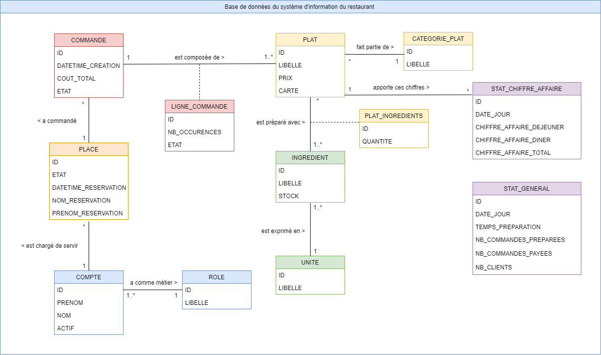
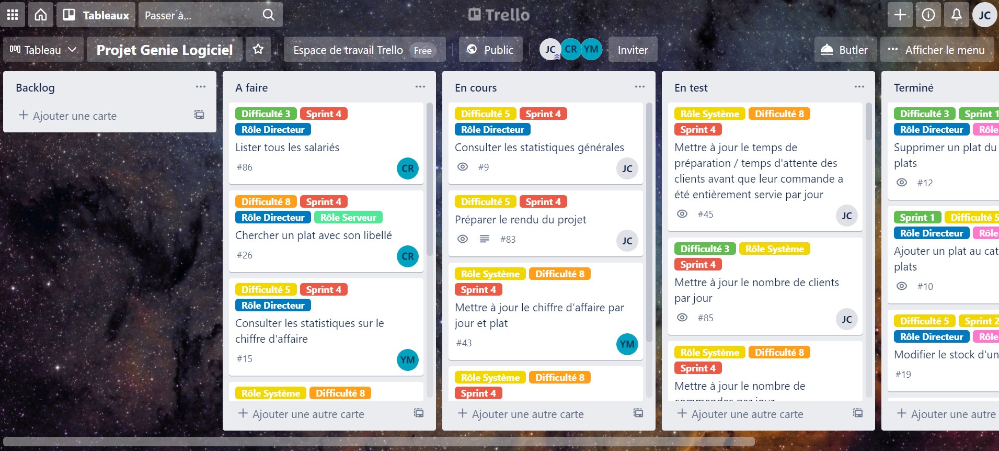

## Projet Restaurant

### Résumé
Projet implémentant un application pour un restaurant.
 
 
Cette application propose différents accès avec différentes 
<b>fonctionnalités</b>, en fonction des différents <b>rôles</b> existants dans le restaurant.
 
 
Voici une liste des rôles du restaurant, ordonné par degré de responsabilité
(du plus élevé au plus faible) : 
- `Directeur` : il peut tout faire dans le restaurant et a en charge pour
  lui seul certaines fonctionnalités comme la composition de la carte du jour,
  ou l'accès aux statistiques
   
   
- `Maitre d'hôtel` : il accueille les clients, alloue et désalloue les tables
  aux clients et aux serveurs, s'occupe des réservations, et prend en charge les paiements
  des clients
   
   
- `Cuisinier` : il compose le catalogue du restaurant : ingrédients, unités, catégorie,
  plat, gère les stocks, et prépare les plats commnandés
   
   
- `Serveur` : il assiste les clients : il fait les commandes pour
  les clients et les sert, il est chargé de certaines tables précises du restaurant
  qui lui ont été allouées 
   
   
- `Assistant de service` : il prépare les tables, c'est-à-dire qu'il les nettoie après chaque départ
des clients

 
Cette application mets à disposition des utilisateurs une 
interface console pour communiquer avec elle.
 
 
Cette application est à voir comme une application métier, fonctionnant comme un
intranet, au sens qu'elle est réservée aux agents du restaurant, il ne s'agit
pas d'une application "vitrine"

____ 
### Organisation

Université de Lorraine
 
Master 1 MIAGE

____ 
### Auteurs

- CHEVRIER Jean-Christophe
- HADJ MESSAOUD Yousra
- LOUGADI Marième

____ 
### Environnements

Le projet a été développé avec deux environnements
- l'environnement principal (développement et de production)
- l'environnement de test

Pour pouvoir utiliser l'application il est nécessaire
de bien intégrer l'existence de ces environnements

Les environnements correspondent chacun à un répertoire du projet :
    
    src/main/       répertoire de l'environnement principal
    src/test/       répertoire de l'environnement de test

Les environnements ont des branches git associées.

De mêmes, chaque environnement fonctionne avec une base de données :
il y a une base de données de développement / production, et une base 
de données de test

En effet, nous avons utilisé des base de données pour la persistence
des données de l'application

Les bases de données des environnements principal et de test
ne sont pas les mêmes, pour que l'environnement principal
<b>ne s'ingère pas dans les comportements des tests</b>, et aussi parce 
que l'environnement principal passera de développement à production 
avec le temps, et des données de production n'ont rien à faire dans 
des tests

____ 
### Installation

Que ce soit pour l'environnement principal ou de test,
l'installation est <b>indispensable</b>, avant toute autre action

#### Installation de l'environnement principal

Pour installer l'environnement principal :

1. Avoir `PostgreSQL` sur la machine hévbergeant l'application
   

2. Avoir le répertoitre `bin/` de `PostgreSQL` dans la variable PATH de votre OS
    
   Sous windows, le chemin du `bin/` ressemble en génaral à ça : `C:\Program Files\PostgreSQL\{{VERSION}}\bin`
    
   Et à ceci sous Mac ou Linux :

3. Compléter le fichier de configuration de la base de données
   de l'environnement principal : 
   `/src/main/resources/fr/ul/miage/m1/projet_genie_logiciel/configuration/configuration.properties`

4. Lancer l'exécutable .bat ou .sh (selon votre OS) de réinitialisation de la base de données
   de l'environnement principal :
   `/src/main/sql/fr/ul/miage/m1/projet_genie_logiciel/reconstruire_bdd(.bat|.sh)`
   

   Notes : 
   - toute connexion ouverte en parallèle sur votre base de données fera échouée l'exécutable : 
    aucune connexion à la base de données ne doit être ouverte au moment de son exécution
      
      
   - l'exécutable utilise la configuration de la base de de données de l'environnement, donc
    si elle comporte des erreurs, l'exécution échouera
      
      
   - sauf exception, si l'exécution a réussi, il ne doit pas avoir eu de log dans le terminla
    au cours de son exécution
      
      
   - l'exécutable crée les tables, insert les rôles, et les comptes d'utilisateur fictifs,
     déclarés dans les scripts SQL des sous répertoires du répertoire :
     `/src/main/sql/fr/ul/miage/m1/projet_genie_logiciel/`
     
#### Installation de l'environnement de test

Pour installer l'environnement de test :

Suivre les mêmes instructions que pour l'environnement principal, 
à l'exception que l'environnement de test utilise cette configuration :
`/src/test/resources/fr/ul/miage/m1/projet_genie_logiciel/configuration/configuration.properties`,
 
et ces exéctutables de réinitialisation :
`/src/test/sql/fr/ul/miage/m1/projet_genie_logiciel/reconstruire_bdd_test(.bat|.sh)`

#### Listing des comptes fictifs

Ce sont ces rôles fictifs qui ont insérés par les exécutables renseignées précédemment :

- `LAURENT Victoria` : directrice
- `DURAND Olivier` : cuisinier
- `CARON Jules` : maitre d'hôtel
- `DUPONT Théo` : serveur
- `ANDERSON Christa` : assistant de service

____ 
### Exécution

- Sous Windows : `.\restaurant.bat`
- Sous Linux, ou Mac : `./restaurant.sh`

____ 
### Exemple de cas d'utilisation : un client arrive dans le restaurant
TODO
____ 
### Langages

- `PostgreSQL 13`
- `Java 1.8`

Le projet a été développé et compilé avec`Maven` en `Java 1.8`.

____ 
### Librairies

- Librairie `driver JAVA` pour la communication avec `PostgresSQL` :
   
  https://mvnrepository.com/artifact/org.postgresql/postgresql/42.2.19
- Librairie des annotations `@NotNull` de `Jetbrains` :
   
  https://mvnrepository.com/artifact/org.jetbrains/annotations/16.0.2
- Librairie des tests unitaires `JUnit` :
   
  https://mvnrepository.com/artifact/org.junit.jupiter/junit-jupiter-api/5.6.2

Consulter le fichier `pom.xml` du projet pour voir le détail

____ 
### Architecture logicielle

#### Architecture de l'environnement principal

    src/main/java/fr/ul/miage/m1/projet_genie_logiciel/
        controleurs/
            controleurs implémentant les focntionnalités de l'application
        
        entites/
            classes entités reflet des tables de la base de données 
        
        orm/ORM.java
            classe appliquant une couche au dessus du driver de PostgreSQL,
            pour simplifier la communication inspiré de la librairie Doctrine 
            de Symfony
        
        ui/UI.java
            classe proposant des outils pour l'utilisation de l'interace utilisateur
            console

    src/main/sql/fr/ul/miage/m1/projet_genie_logiciel/configuration/configuration.properties
        configuration pour la conenxion à la base de données

    src/main/sql/fr/ul/miage/m1/projet_genie_logiciel/
        initialisation/
            scripts pour l'initialisation de la base de données :
            pour la création des tables, et l'insertion des rôles
        
        jeu_de_donnees/
            scripts pour les insertions du jeu de données
        
        reconstruire_bdd.bat
        reconstruire_bdd.sh
            exécutables pour la réinitilisation à zero de la base de données

#### Architecture de l'environnement de test

    src/test/java/fr/ul/miage/m1/projet_genie_logiciel/
        classes de test

    src/test/sql/fr/ul/miage/m1/projet_genie_logiciel/configuration/configuration.properties
        configuration pour la connexion à la base de données de test

    src/test/sql/fr/ul/miage/m1/projet_genie_logiciel/
        reconstruire_bdd_test.bat
        reconstruire_bdd_test.sh
            exécutables pour la réinitilisation à zero de la base de données de test

#### Exécutables de l'application

    bin/
        classes compilées de l'environnement principal, utilsiées par les exécutables
        de l'application restaurant(.bat|.sh)

    restaurant.bat
    restaurant.sh
        exécutables pour le lancement de l'application

____             
### Diagramme de classes de la base de données

Ci-dessous le diagramme de classes de la base de données du projet :

Notes : les environnements ont tous les mêmes tables dans leur base de données

____ 
### Branches GIT

Ci-dessous la liste des branches `GIT` du projet, ordonnées dans l'ordre d'implémentation
des fonctionnalités (`feature` > `dev` > `test` > `prod`)

    feature.*   Branches unitaires de chaque fonctionnalité 
    dev         Branche de développement
    test        Branche de test
    prod        Branche de la production

____ 
### SCRUM

Le projet a été développé selon la méthodologie `SCRUM`,
les users stories avaient été réparties sur 4 sprints,
chacun d'une durée de 1 semaine et 3 jour et demi, soit de 10,5 jours :
- `Sprint 1` : 19/04/2021 - 29/04/2021
- `Sprint 2` : 29/04/2021 - 09/05/2021
- `Sprint 3` : 10/05/2021 - 20/05/2021
- `Sprint 4` : 20/05/2021 - 30/05/2021

Nous avons utilisé `Trello` comme logiciel de gestion de tâches pour notre projet

Ci-dessous une capture d'écran du `Trello` prise en milieu de `Sprint 4`:

Ci-après un lien vers le trello du projet : https://trello.com/b/TfXYv9Dy/projet-genie-logiciel

____ 
### Notes et remarques

- Nous sommes un groupe d'alternants
   
   
- Nous avons choisi dans le cadre de notre projet, de réaliser les tests en fin de sprint
  et non en début de sprint, comme nous avions pu en l'observer en entreprise, de plus
  cela nous a permis de rendre plus faisable ce projet avec nos emplois du temps d'alternants
   
   
- Les fichiers de configuration de base de données sont présents pour cette phase
  de rendu, sur le répertoire GIT, mais en temps normal, il ne faut jamais
  partager un fichier de configuration, puisque par définition des fichiers 
  dépendent de la configuration de chaque utilisateur, et ne sont donc
  pas partageables
   
   
- Nous avons implémenté toutes les fonctionnalités pour le projet 
   
   